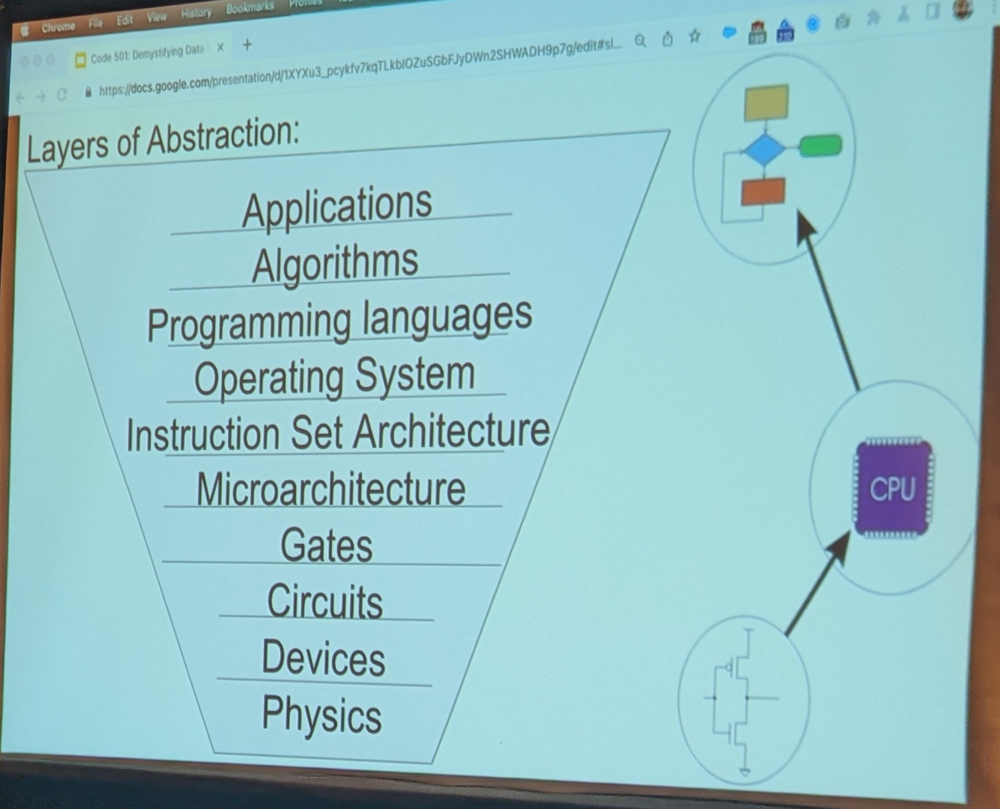
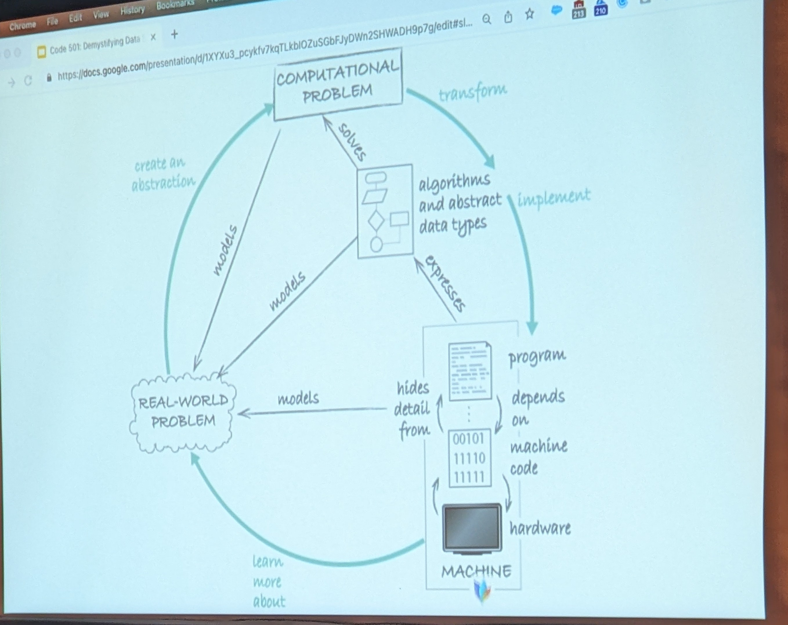

# Demystifying Data Structures Notes by Brook Riggio, 2022 CascadiaJS

## Intro

- Everytime you create an object, you introduce a layer of abstraction.
- You can swap out any layer.
- Hiding details below, usage API looking up

> Computational thinking - formulating a problem and expressing it's solution. Process.

- modeling a problem : finding the right details to focus on.
- Computing is instructions and data > processed > result

- Abstractions map to specific problems > make it simpler

## Abstract Data Structures

- Array
- [Linked List](https://my.mindnode.com/3qHEkZSjxuNFsVQvrN3Prm6smDzeLKcKA8P8sZF3)
- [Stack](https://my.mindnode.com/9S8sTq6q68R3S9ZsBMqqZynyMpS6HRVGR7jhqjzk)
- [Queue](https://my.mindnode.com/Ggp2kJzx8z96zAnfaSJGNGwH4tpVCpLsu3PZjF8L)
- [Binary Tree](https://my.mindnode.com/ByphRGZUs9yfqksaLzMqDVsmsTeBaJ2W4ioq1p5p)
  - K-Ary Tree
  - Graph
- [Hashmap](https://my.mindnode.com/ZwYyemgphkpraukAr2xHunfbKhR1bxd7XLL1qtzn)

## Data

- RAM
  - addressable memory, like a spreadsheet; columns & rows.
  - use additional memory for pointers. Linked list.
  - each cell is a node.

## Linked List

- Single linked list you know next but not previous (doubly for both).
- Value and next.
- A collection of nodes where each node holds a value and a pointer to the next node.
- Use cases: version history, carousel/slideshow, API pagination, blockchains.
- Traversed the list, traversal.
- Primary operations: add, traverse, size.

Side note: while is preferable over a for loop when length is unknown.

O notation:

- O of 1 = constant time; don't need to know the length
- 0(n) search

## Stack

- Last in, first out. Pushing and popping one value at a time.
- Examples: browser history, backtracking apps, undo/redo.
- A stack is a collection of nodes where each node holds a value accessible in LIFO order.

## Queue

- FIFO
- JavaScript is event driven programming.
- [What the heck is the event loop anyway? | Philip Roberts | JSConf EU](https://www.youtube.com/watch?v=8aGhZQkoFbQ)
- Messaging services:
  - Amazon SQS
  - RabbitMQ
- A queue is a collection of nodes where each node holds a value accessible in FIFO order.
- O(1) enqueue and dequeue
- Cannot traverse, no random access.
- Priority queue - assign priority to nodes.

## Array

- Ammortizes cost with add, memory offsets.
- Proportionally allocate more RAM room.
- JavaScript uses dynamic arrays.
- Buffer overflow attack. punch through at the end of array and inject code.
- Sortable.
- A collection of values indexed from an initial point in memory individually accessible at an offset.
- Sequential access (for-loop), efficient.
- Reserves memory as it grows: 0(2n) space.
  - A linked list would be 0(1) for inserting in the middle
- Merge sort, quick sort and insert sort.
- Binary search algorithm.

## Binary Tree

- Analogies: [reverse polish notation](https://en.wikipedia.org/wiki/Reverse_Polish_notation), dichotomous key, branching river.
- Examples: AI/ML decision tree, huffman coding (.jpeg compression), etc.
- "Binary search tree" and "B trees" are different than a binary tree.
- Traversing: breadth or width first.
- Full, perfect, complete; root, branch, leaf, height.
- Strengths: O(log n) search, elegant recursion, simplicity of interface

## Hash Maps

- Hashing (used bcrypt in past).
- Key values.
- Analogies: dictionary, GPS coordinates, upc codes, license plates, ssn
- Objects in objects.
- A collection of values labeled with infinite key possibilities stored in a finite amount of memory.
- o(1) time

## Further Research

- Gayle Laakmann McDowell videos
